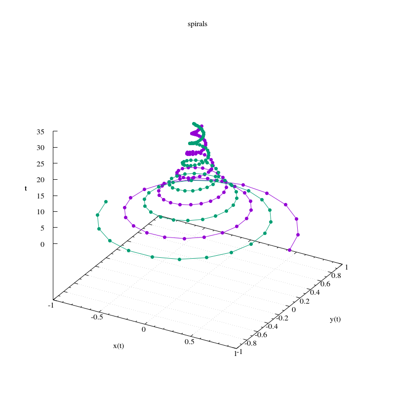

Examples
========

The :file:`examples` directory contains the following examples:

gnuplot
-------

minimal
^^^^^^^

A (near) minimal example from :file:`examples/gnuplot_minimal/minimal.py`:

.. include:: ../examples/gnuplot_minimal/minimal.py
  :code:

.. image:: ../examples/gnuplot_minimal/expected_output/output.png
   :alt: minimal.py output
   :scale: 40 %

basic 1
^^^^^^^

From :file:`examples/gnuplot_basic1/basic1.py`:

.. include:: ../examples/gnuplot_basic1/basic1.py
  :code:

basic 2
^^^^^^^

From :file:`examples/gnuplot_basic2/basic2.py`:

.. include:: ../examples/gnuplot_basic2/basic2.py
  :code:

Parametric curve with arrows indicating direction
^^^^^^^^^^^^^^^^^^^^^^^^^^^^^^^^^^^^^^^^^^^^^^^^^

This is an example where the :file:`.preprocess` script does something non-trivial.

From :file:`examples/gnuplot_with_direction/with_direction.py`:

.. include:: ../examples/gnuplot_with_direction/with_direction.py
  :code:

Parametric curves with the parameter on the z axis
^^^^^^^^^^^^^^^^^^^^^^^^^^^^^^^^^^^^^^^^^^^^^^^^^^

From :file:`examples/gnuplot_curve_in_3d/curve_in_3d.py`:

.. include:: ../examples/gnuplot_curve_in_3d/curve_in_3d.py
  :code:

2D sweep
^^^^^^^^

A typical (noisy) measurement as a function of two sweep parameters from :file:`examples/gnuplot_heatmap/heatmap.py`.

Another example where the :file:`.preprocess` script does something non-trivial.

.. include:: ../examples/gnuplot_heatmap/heatmap.py
  :code:

.. image:: ../examples/gnuplot_heatmap/expected_output/output.png
   :alt: heatmap.py output

