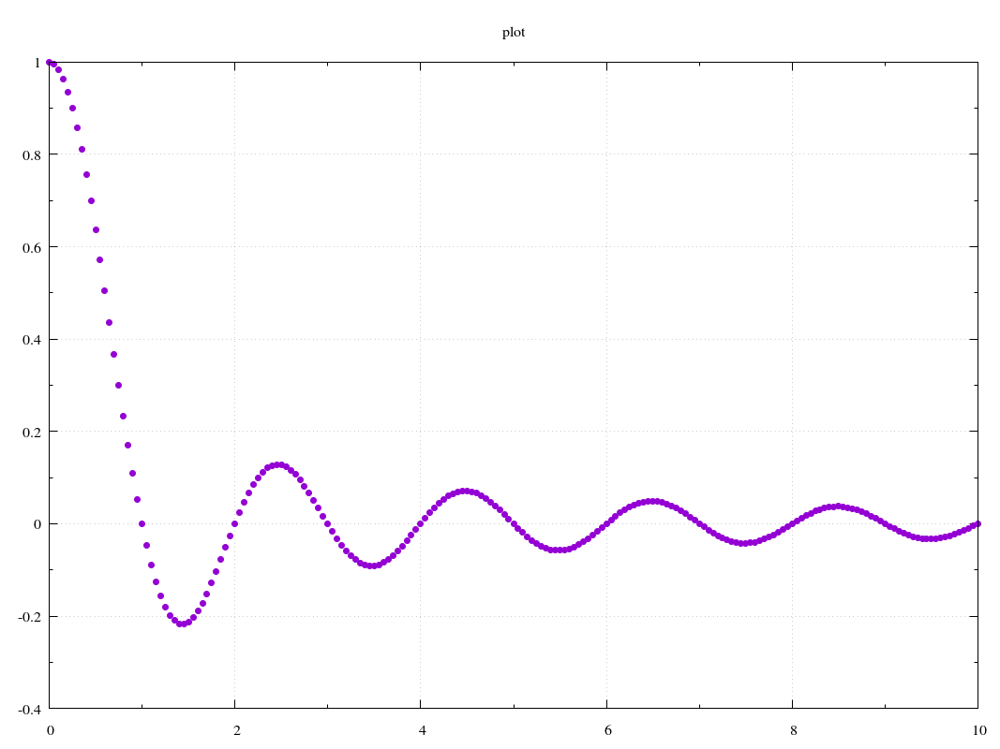
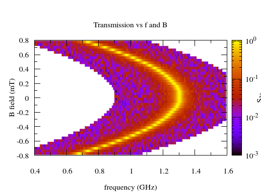

.. plotbridge documentation master file, created by
   sphinx-quickstart on Fri May  6 21:26:27 2016.
   You can adapt this file completely to your liking, but it should at least
   contain the root `toctree` directive.

plotbridge: A template-based bridge between Python and your plot engine
=======================================================================

With a plotbridge **template**, you can use your **favorite plotting
program** for visualizing the results of your Python data analysis or
simulation code. The purpose is to keep the Python side free of most
formatting details, while allowing arbitrarily complex templates (and
optional preprocessing steps) that can produce publication quality
plots in an automated and repeatable way.

Plotbridge relies heavily on `Jinja2 <http://jinja.pocoo.org/>`_ and,
of course, the plot engines that the templates target.

.. note::
  If you're familiar with PHP, think of the template as the HTML + PHP
  markup, but with HTML replaced by your plot engine syntax (e.g.,
  `gnuplot <http://www.gnuplot.info/>`_) and PHP replaced by `Jinja2
  <http://jinja.pocoo.org/>`_.

Getting started
---------------

Without further ado, we give some basic examples below. See the
:doc:`examples` page for more.

Hello, world!
^^^^^^^^^^^^^

A (near) minimal example from :file:`examples/gnuplot_minimal/minimal.py`:

.. include:: ../examples/gnuplot_minimal/minimal.py
  :code:

2D sweep
^^^^^^^^

A typical (noisy) measurement as a function of two sweep parameters from :file:`examples/gnuplot_heatmap/heatmap.py`:

.. include:: ../examples/gnuplot_heatmap/heatmap.py
  :code:

Templates
---------

The inputs to plotbridge are (a) the data points and basic plot
options from Python and (b) a template from a text file.  Optionally,
you can include a *preprocess* script (e.g. in Python) that massages
the data before passing it to your plotting program.

For example, the :code:`gnuplot_2d` template is defined by the files
in the directory :file:`default_templates/gnuplot_2d` (and the
:file:`common_helper_scripts` directory):

  * :download:`gnuplot_2d.template
    <../plotbridge/default_templates/gnuplot_2d/gnuplot_2d.template>`
    -- the main template as gnuplot + jinja2 markup
  * :download:`gnuplot_2d.cfg
    <../plotbridge/default_templates/gnuplot_2d/gnuplot_2d.cfg>` -- a
    config file for miscellaneous settings
  * :download:`gnuplot.interactive.py
    <../plotbridge/common_helper_scripts/gnuplot.interactive.py>` --
    an optional script that runs the plot interactively (if different
    from running the plot script directly).

..  * :download:`gnuplot_2d.preprocess <../plotbridge/default_templates/gnuplot_2d/gnuplot_2d.preprocess>` -- an optional script that preprocesses the
      trace data before the plot engine (gnuplot) is called

.. note:: Common scripts shared by many templates (such as
    :file:`gnuplot.interactive.py`) reside in the
    :file:`common_helper_scripts` directory, instead of the template
    directory.

Some templates are provided in the :file:`default_templates` directory.
They are great for your initial quick-and-dirty plots.

However, you'll want a custom template for the vast majority of
published plots. The easiest way to do this is to copy one of the
directories from the :file:`default_templates` directory to your
working directory, rename it, change the :code:`template=...` argument
to :meth:`plot.Plot.__init__` to the same name, and start hacking.

.. note:: The names of the :file:`.template` and the :file:`.cfg`,
  files must match the name of the template directory. The names of
  the (optional) :file:`.preprocess` and :file:`.interactive.py` files
  are specified in the :file:`.cfg` file.
  

.. note:: In addition to the standard files, you can have arbitrary
  files in the template. They will all be copied to the plot directory
  upon calling :meth:`plot.Plot.__init__`.

What templates look like
^^^^^^^^^^^^^^^^^^^^^^^^

Here are some example statements you might find a typical (gnuplot)
:file:`.template` file::

  
  
  set ylabel "{{ global_opts.ylabel }}" offset -1,0
  
  ...

  
  set logscale x
  
  ...

  
  set xrange [{{ global_opts.xrange[0]|ifnone('') }}:{{ global_opts.xrange[1]|ifnone('') }}]
  
  ...

  plot \
  
   ...
   linetype {{ trace.linetype|ifnone(1) }} \
   ...
  

  
If you wanted to, say, move the y-axis label a tiny bit to the left
and up, you could change the :code:`offset -1,0` to :code:`offset
-1.5,1`. That's the power of custom templates: you can control the
finest formatting details while keeping the Python interface simple.

If you wanted to create a template for your favorite plot engine, you
would simply replace the gnuplot commands by the appropriate commands
(e.g., for Matlab, :code:`set(ax,'XScale','log');` instead of
:code:`set logscale x`).

The variables available in the templates consist of (a) the plot-level
:code:`global_opts` specified with the :code:`set_*` methods of the
:class:`plot.Plot` class and (b) the per-trace :code:`trace.*` options
passed to :meth:`plot.Plot.add_trace`.

.. note:: The :code:`include` Jinja2 statement is handy for
  reusing template fragments in multiple templates. You can include
  any file in your template directory or in the default
  :file:`template_fragments` directory.

.. note:: You can also use Jinja2's built-in `template inheritance
  <http://jinja.pocoo.org/docs/dev/templates/#template-inheritance>`_,
  which allows for more sophisticated nesting of templates. However,
  in that case you would specify the references in the "opposite
  direction," i.e., one base template would define the overall
  structure with placeholder blocks that different child templates
  would fill in differently.

Template configuration file (:file:`.cfg`)
^^^^^^^^^^^^^^^^^^^^^^^^^^^^^^^^^^^^^^^^^^

The :file:`.cfg` file specifies miscellaneous template options:

* extension -- Extension of the main plot file (e.g. :file:`.gnuplot`).

* executable -- Mark the generated plot script as directly executable
  (N/A to Windows)?

* interactive-script -- (Optional) name of a script that creates an
  interactive version of the plot
  (e.g. :file:`gnuplot.interactive.py`). Just the extension is enough
  if the file is in the template directory. If no match is found in
  the template directory, the :file:`common_helper_scripts` directory
  is also searched.

* preprocess-script -- Same as interactive-script, but for the
  (optional) preprocess script.

* preprocess-timeout -- Max. number of seconds given to preprocess script
  to finish (specify as an integer).

* interpreter -- If not empty, pass the output plot script
  (e.g. :file:`myplot.gnuplot`) as an argument to the interpreter
  (e.g. :file:`gnuplot`).

* interactive-interpreter -- If not empty, pass the interactive script
  (e.g. :file:`gnuplot.interactive.py`) as an argument to the interpreter
  (e.g. :file:`python`).

* preprocess-interpreter -- If not empty, pass the preprocess script
  (e.g. :file:`gnuplot_2d_stacked_image.preprocess`) as an argument to
  the interpreter (e.g. :file:`python`).

* export-formats -- A space separated list of available export
  formats (e.g. :file:`png pdf`).

Plots
-----

Once a plot is generated from the template, the output directory is
fully independent of the template and the code that generated it. For
example, the :file:`plot` subdirectory generated by :file:`minimal.py`
above contains:

  * :file:`plot.gnuplot` -- The main plot script produced from
    :file:`gnuplot_2d.template`.
  * :file:`trace_UUID1.bytes` -- Binary data for trace 1 (referenced
    in :file:`plot.gnuplot`).
  * :file:`gnuplot_2d.interactive.py` -- A copy from the template
    directory. Calling :meth:`plot.Plot.run` executes this.
  * :file:`gnuplot_2d.interactive.py.out` -- Textual output from the
    script above. Check this if the plot does not pop up after calling
    :meth:`plot.Plot.run`.
  * :file:`output.png` -- Generated after calling :meth:`plot.Plot.run`.

..  * :file:`gnuplot_2d.preprocess` -- A copy from the template
      directory. Calling :meth:`plot.Plot.update` executes this.
    * :file:`gnuplot_2d.preprocess.out` -- Textual output from the
      script above. Check this if the plot does not pop up after calling
      :meth:`plot.Plot.run`.

You can modify :file:`plot.gnuplot`, move the directory elsewhere, or
re-execute :file:`gnuplot_2d.interactive.py` to your heart's
content. However, it's usually smarter to create a custom template and
modify that instead, unless you're absolutely sure you won't need to
update the data points later.

.. warning:: If you do modify the output directory, watch out for your
  original Python process (if it's still running) calling
  :meth:`plot.Plot.update`. That overwrites :file:`plot.gnuplot`!
  Similarly, calling :meth:`plot.Plot.__init__` with
  :code:`overwrite=True` and the same :code:`name` and
  :code:`output_dir` will erase all contents of the plot directory!

In the wild
-----------

Plotbridge is used (at least) in:

* `qtlab <https://github.com/govenius/qtlab>`_ -- a Python framework
  for running computer-controlled experiments.
* J. Govenius et al., "Parity measurement of remote qubits using
  dispersive coupling and photodetection," `Phys. Rev. A 92,
  042305 (2015) <http://dx.doi.org/10.1103/PhysRevA.92.042305>`_ (open
  access).
* J. Govenius et al., "Detection of zeptojoule microwave pulses using
  electrothermal feedback in proximity-induced Josephson junctions,"
  `Phys. Rev. Lett. 117, 030802, (2016)
  <http://dx.doi.org/10.1103/PhysRevLett.117.030802>`_ (open access).

Other content in this manual
----------------------------

.. toctree::
    :maxdepth: 2

    examples
    install
    api
    contributing
